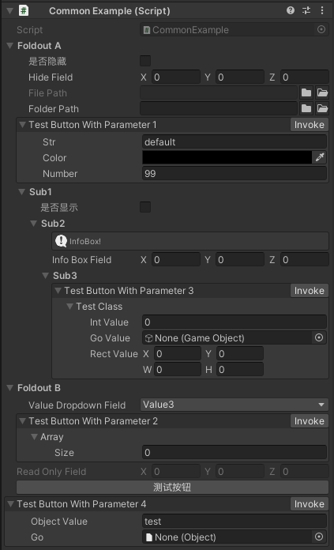
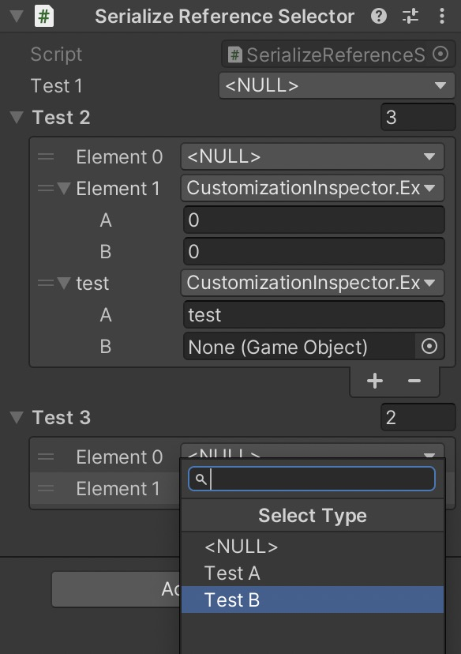
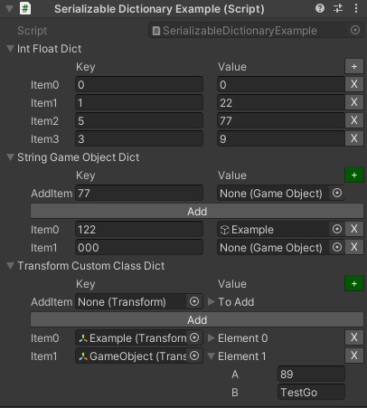
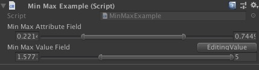
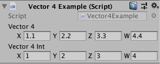

# CustomizationInspector
Customize Unity3D inspector by attribute(such as Button, ReadOnly, HideIf etc.) and serializable dictionary.

## Features
* Provide some attributes to change original inspector.
  - Foldout
  - Rename
  - HideIf
  - ShowIf
  - ReadOnly
  - ValueDropdown
  - InfoBox
  - Button
  - FilePath
  - FolderPath
  - MinMax
  - SerializeReferenceSelector
* Serialize dictionary class to easy edit in inspector.
* Redraw `Vector4` and `Vector4Int` inspector.

## Effect
* CommonAttributes

* SerializeReferenceSelector

* SerializableDictionary

* MinMax

* Vector4

