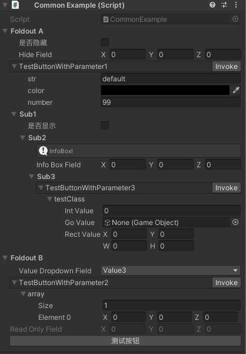
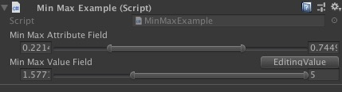
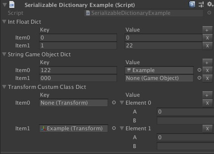
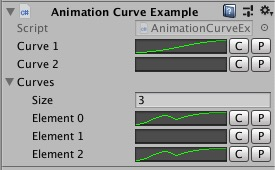

# CustomizationInspector
Customize Unity3D inspector by attribute(such as Button, ReadOnly, HideIf etc.) and serializable dictionary.

## Features
* Provide some attributes to change original inspector.(Foldout,Rename,HideIf,ShowIf,ReadOnly,ValueDropdown,InfoBox,MinMax,Button...)
* Serialize dictionary class to easy edit in inspector.
* Redraw `Vector4` and `Vector4Int` inspector.
* Add Copy and Paste button on `AnimationCurve` inspector.

## Effect
* CommonAttributes

* MinMax

* SerializableDictionary

* AnimationCurve

* Vector4

## Note
`AnimationCurve` require [UnityExtensionUtil](https://github.com/Mr-sB/UnityExtensionUtil) module.
